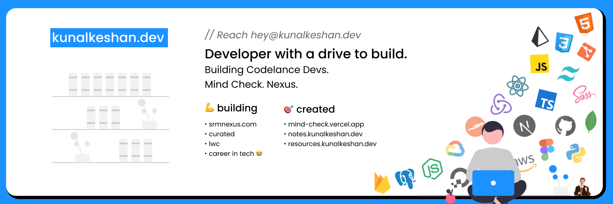

<!-- " /> -->
<h1 align="center">
  
  Hello there, I'm [Kunal Keshan][WEBSITE]
  
</h1>

  

 

  

  I am a student of electronics with a knack for computer science. Currently learning the fundamentals of computer construction, from 1s and 0s to high-level programming languages. I am an ambitious software developer with experience in web development and open-source project development and contribution.
  

  
  

  <h2>⚙️ Technologies and Skills</h2>
   
  
   
  
   

  <h2>Languages, Frameworks & Tools</h2>
  
    
  <h2>Actively Learning</h3>
  

<h2 align="center"> Let's get in touch </h2>

  
  
  
  
  
  

<!-- <h2>👩‍💻 Projects</h2> -->

-------

  

  <h2>🏆 My Github Stats</h2>
  <table>
    <tr>
      <td>
        
      </td>
      <td>
               </td>
    </tr>
  </table>

  

<!-- 

  

 -->
  
[WEBSITE]: https://kunalkeshan.dev
[LINKEDIN]: https://www.linkedin.com/in/kunalkeshan/
[TWITTER]: https://twitter.com/_kunalkeshan_
[INSTAGRAM]: https://www.instagram.com/kunalkeshan/
[YOUTUBE]: https://www.youtube.com/channel/UCwVRztzBdqgB_Y9hkMX3lZA
[FACEBOOK]: https://www.facebook.com/kunalkeshans/
[EMAIL]: mailto:kunalkeshan12@gmail.com
[BLOG]: https://blog.kunalkeshan.dev

<!-- USE LATER  

Link containing image

-->
