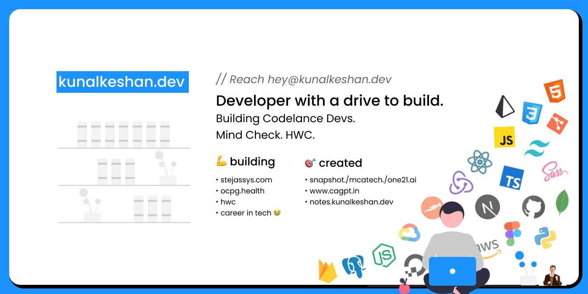

<!-- " /> -->
<h1 align="center">
  Hello there, I'm Kunal Keshan
  
</h1>

  

 

  

  What keeps me interested in engineering isn't just building — it's understanding how things hold up over time. I work as a software engineer, focused on clean design, practical decisions, and systems I can stand behind, alongside a small number of freelance and consulting projects on the side. Over time, my priorities have shifted from speed toward clarity and consistency — thinking less about the immediate task and more about how things evolve for users, teams, and the product itself. Still curious, still learning, and always up for approaching problems the grounded way.
  

  
  

  <h2>⚙️ Technologies and Skills</h2>
   
  
   
  
   

  <h3>Languages</h3>
  

  <h3>Frontend & Mobile</h3>
  
   
  
  
  
  
  
  
  

  <h3>Backend</h3>
  
   
  
  
  
  

  <h3>Databases</h3>
  

  <h3>Cloud & Infrastructure</h3>
  

  <h3>CMS & Content</h3>
  
  
  
  

  <h3>Auth & Security</h3>
  
  
  

  <h3>Payments</h3>
  

  <h3>AI & ML</h3>
  
  
  

  <h3>Messaging & Integrations</h3>
  
  
  

  <h3>DevOps & Tooling</h3>
  
   
  

  <h3>Testing</h3>
  

<h2 align="center"> Let's get in touch </h2>

  
  
  
  
  
  

<!-- <h2>👩‍💻 Projects</h2> -->

-------

  

  <h2>🏆 My Github Stats</h2>
  <table>
    <tr>
      <td>
        
      </td>
      <td>
               </td>
    </tr>
  </table>

  

<!-- 

  

 -->
  
[WEBSITE]: https://kunalkeshan.dev
[LINKEDIN]: https://www.linkedin.com/in/kunalkeshan/
[TWITTER]: https://twitter.com/_kunalkeshan_
[INSTAGRAM]: https://www.instagram.com/kunalkeshan/
[YOUTUBE]: https://www.youtube.com/channel/UCwVRztzBdqgB_Y9hkMX3lZA
[FACEBOOK]: https://www.facebook.com/kunalkeshans/
[EMAIL]: mailto:kunalkeshan12@gmail.com
[BLOG]: https://blog.kunalkeshan.dev

<!-- USE LATER  

Link containing image

-->
